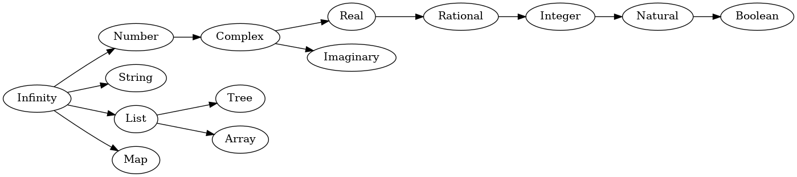

# Infinity Lang Type System
Documentation and reference implementation of the Infinity Lang type system.

All types within the Infinity Language are treated as abstract concepts.

One side-effect of this is that there are no concrete fixed-width types. That isn't to say that types with a fixed bit-width do not exist (e.g. `Int32`, `Real32`, `Nat32`, etc.) but that they simply do not have a single universal underlying type.

This can usually be treated as an implementation detail. E.g. on a system with no support for 16-bit integers, `Int16` might be represented by the C type `int32_t` but on other (more traditional) systems it would more probably be represented by `int16_t`.

## The `Infinity` Type

The `Infinity` type is the base for all types in Infinity Lang.

When creating more specialized types, we can think of the process as restricting the range of values of some other type.
This concept applies to every type in the system, so there must be some type that can represent *every* value. This is where the `Infinity` type comes in to play. It is a recursive type, using itself as it's base type, that represents any possible value (existing or not). We refine this type further to get sub-groups of values e.g. the `Complex` or `Rational` numbers.

## Base Types

There are a number of base types (that may be based on one another) used as the basis for value types.

| Description                                  | Abstract Type | Base       | Example Implementation     |
| -------------------------------------------- | ------------- | ---------- | -------------------------- |
| An atomic mathematical unit                  | `Number`      | `Infinity` | N/A                        |
| A string of characters                       | `String`      | `Infinity` | N/A                        |
| Mapping from keys to values                  | `Map K T`     | `Infinity` | N/A                        |
| A list of values of `T`                      | `List T`      | `Infinity` | N/A                        |
| A tree structure with nodes of `T`           | `Tree T`      | `List T`   | N/A                        |
| A contiguously laid out series of `T` values | `Array T`     | `List T`   | N/A                        |
| Complex numbers                              | `Complex`     | `Number`   | C `_Complex` type          |
| Imaginary numbers                            | `Imaginary`   | `Complex`  | C `_Imaginary` type        |
| Real numbers                                 | `Real`        | `Complex`  | C `float` or `double` type |
| Rational Real numbers                        | `Rational`    | `Real`     | Pair of an `Integer` type  |
| Whole numbers                                | `Integer`     | `Rational` | C `int32_t` type           |
| Counting numbers                             | `Natural`     | `Integer`  | C `uint32_t` type          |

## Value Types

Value types are those that are refined within their group such that they encodes the value set and the range of possible values.

> Wherever a type is suffixed by an uppercase `N`, `N` may be replaced by some desired bit-width.

| Complete Type | Abstract Base | Value Syntax                           | Possible C/C++ Type                |
| ------------- | ------------- | -------------------------------------- | ---------------------------------- |
| `NaturalN`    | `Natural`     | `0`, `1`, `2`, `3`, ...                | `uintN_t`                          |
| `IntegerN`    | `Integer`     | `1`, `0`, `-1`, `-2`, ...              | `intN_t`                           |
| `RationalN`   | `Rational`    | `1/3`, `2/7`, `6/21`, ...              | `div_t`, `ldiv_t`, etc.            |
| `RealN`       | `Real`        | `0.1`, `1.1111`, `69.420`, `9001`, ... | `float`, `double` or `long double` |

## Compound Types

Compound types are used to construct more complicated types from other types.

| Name                         | Abstract Base | Type Syntax        | Value Syntax                              | Possible C/C++ Type        |
| ---------------------------- | ------------- | ------------------ | ----------------------------------------- | -------------------------- |
| Static array                 | `Array T`     | `StaticArray T N`  | `[x0, x1, xn...]`                         | `T[N]`                     |
| Ordered map                  | `Map K T`     | `OrderedMap K T`   | `["x0" -> x0, "x1" -> x1, "xn" -> xn...]` | `std::map<K, T>`           |
| Unordered map                | `Map K T`     | `UnorderedMap K T` | Same as above                             | `std::unordered_map<K, T>` |
| Sum type / Union             | N/A           | `T \| U...`         | Value of any of the summed types          | `std::variant<T, U...>`    |
| Product type / Tuple         | N/A           | `T * U...`         | `(1, "Hello")`                            | `std::tuple<T, U...>`      |
| Composite data type / Struct | N/A           | `{x: T, xs: U...}` | Constructor based                         | `struct{ T x; U xs...; }`  |

## Type Promotion

Type promotion is only performed when a sub-type needs to be converted to it's base.

E.g. for number types, the following rules apply (for any operation; LHS and RHS are interchangeable wrt type promotion):

| LHS Type   | RHS Type   | Result Type |
| ---------- | ---------- | ----------- |
| `Integer`  | `Natural`  | `Integer`   |
| `Rational` | `Integer`  | `Rational`  |
| `Rational` | `Natural`  | `Rational`  |
| `Real`     | `Integer`  | `Real`      |
| `Real`     | `Rational` | `Real`      |
| `Real`     | `Natural`  | `Real`      |

