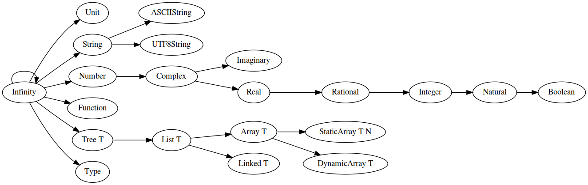

# Infinity Lang Type System
Documentation and implementation of the Infinity language type system.

All types within the Infinity language are treated as abstract refinements of infinity.

One side-effect of this is that there are no concrete fixed-width types. That isn't to say that types with a fixed bit-width do not exist in ilang (e.g. `Int32`, `Real32`, `Nat32`, etc.) but that they simply do not have a single universal underlying type.

This can usually be treated as an implementation detail. E.g. on a system with no support for 16-bit integers, `Int16` may be represented by the C type `int32_t` but on other (more traditional) systems it would more probably be represented by `int16_t`.

## Defining a Type

When creating types, we can think of the process as restricting the range of values of some other type. This concept applies to all types in the system, so there must be some type that can represent *every* value. This is explicitly *every* value and not just *any* value; an instance of this type would hold every single possible value (not just any single one of them) including itself.

This recursively-defined type is named the `Infinity` type and all types are based on it at the lowest level.

### `Infinity`

`Infinity` is recursively defined as the base type of itself and is named so because it stands for the the infinite set containing every possible value known (and unknown) to man. We can not actually create a value of this type (for obvious reasons) but we can refine it to get sub-groups of values e.g. the `Complex` or `Rational` numbers.

### Root Types

A root type is any type directly refined from `Infinity`. They are used as the base for value types.

Common root types:

| Description                 | Root Type |
| --------------------------- | --------- |
| An atomic mathematical unit | `Number`  |
| A string of characters      | `String`  |
| Mapping from keys to values | `Map K T` |
| A list of values of `T`     | `List T`  |

### Refined Types

A refined type is any type based on a root type or other refined type that can not be directly instantiated. They are called *refined* types because they are more refined than a root type, but not refined enough to be used directly for values.

Here is a list of common refined types:

| Description                                  | Refined Type | Base       | Example Implementation     |
| -------------------------------------------- | ------------ | ---------- | -------------------------- |
| A tree structure with nodes of `T`           | `Tree T`     | `List T`   | N/A                        |
| A contiguously laid out series of `T` values | `Array T`    | `List T`   | N/A                        |
| Complex numbers                              | `Complex`    | `Number`   | C `_Complex` type          |
| Imaginary numbers                            | `Imaginary`  | `Complex`  | C `_Imaginary` type        |
| Real numbers                                 | `Real`       | `Complex`  | C `float` or `double` type |
| Rational Real numbers                        | `Rational`   | `Real`     | Pair of an `Integer` type  |
| Whole numbers                                | `Integer`    | `Rational` | C `int32_t` type           |
| Counting numbers                             | `Natural`    | `Integer`  | C `uint32_t` type          |

### Value Types

Value types are any refined type that has been sufficiently refined such that a value of that type is representable/instantiable in a finite amount of space and time.

Here is a list of commonly used value types:

> In this list, wherever a type is suffixed by an uppercase `N`, `N` stands for some desired bit-width.

| Value Type  | Base Type  | Value Syntax                           | Possible C/C++ Type                |
| ----------- | ---------- | -------------------------------------- | ---------------------------------- |
| `NaturalN`  | `Natural`  | `0`, `1`, `2`, `3`, ...                | `uintN_t`                          |
| `IntegerN`  | `Integer`  | `1`, `0`, `-1`, `-2`, ...              | `intN_t`                           |
| `RationalN` | `Rational` | `1/3`, `2/7`, `6/21`, ...              | `div_t`, `ldiv_t`, etc.            |
| `RealN`     | `Real`     | `0.1`, `1.1111`, `69.420`, `9001`, ... | `float`, `double` or `long double` |

### Compound Types

Compound types are used to construct more complicated types from other types. A compound type may fall into the category of 'refined' or 'value' depending on the types used to construct it.

| Name                         | Base Type | Type Syntax        | Value Syntax                              | Possible C/C++ Type        |
| ---------------------------- | --------- | ------------------ | ----------------------------------------- | -------------------------- |
| Static array                 | `Array T` | `StaticArray T N`  | `[x0, x1, xn...]`                         | `T[N]`                     |
| Ordered map                  | `Map K T` | `OrderedMap K T`   | `["x0" -> x0, "x1" -> x1, "xn" -> xn...]` | `std::map<K, T>`           |
| Unordered map                | `Map K T` | `UnorderedMap K T` | Same as above                             | `std::unordered_map<K, T>` |
| Sum type / Union             | N/A       | `T \| U...`         | Value of any of the summed types          | `std::variant<T, U...>`    |
| Product type / Tuple         | N/A       | `T * U...`         | `(1, "Hello")`                            | `std::tuple<T, U...>`      |
| Composite data type / Struct | N/A       | `{x: T, xs: U...}` | Constructor based                         | `struct{ T x; U xs...; }`  |

## Type Promotion

Type promotion may only occur from a more refined type to it's base. No lossy conversion is ever performed; if this is required a type *conversion* is necessary.

## Type Conversion

This is the process of converting a value from one group to a non-related group

